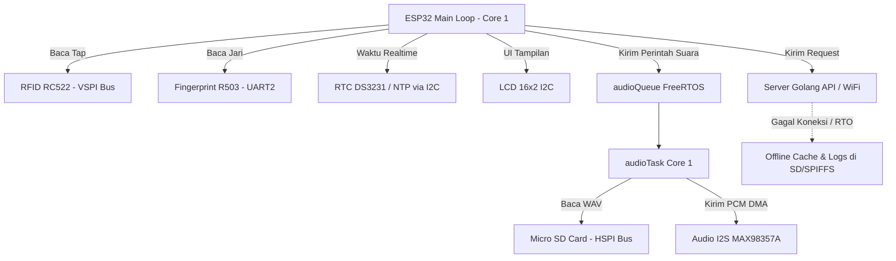
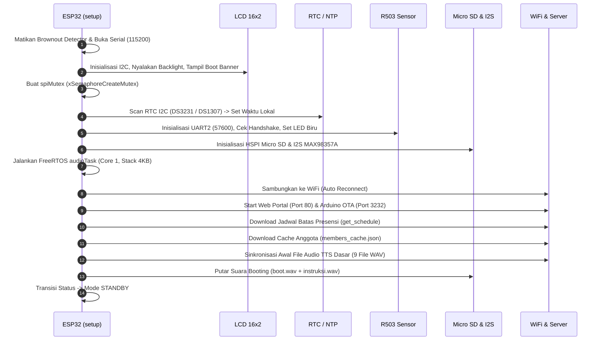
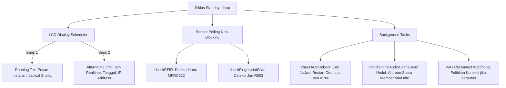
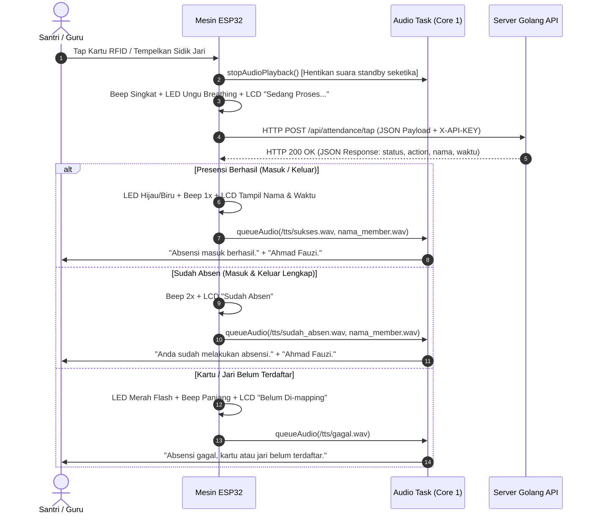
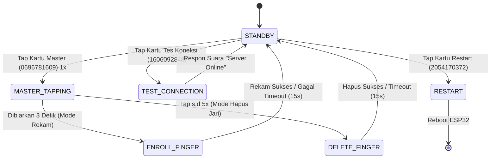

# 📖 Dokumentasi Arsitektur & Alur Kerja Mesin Presensi IoT ESP32
**SIAKAD Absensi Digital (RFID RC522 + Fingerprint R503 + I2S Audio MAX98357A + Micro SD + LCD 16x2)**

Dokumen ini ditujukan bagi pengembang (*developer*) berikutnya untuk memahami secara mendalam cara kerja, struktur internal, alur proses (*sequence flow*), serta penanganan konkurensi hardware pada firmware mesin presensi berbasis **ESP32** (`fw/fw.ino`).

---

## 📑 Daftar Isi
1. [Ikhtisar Arsitektur Sistem](#1-ikhtisar-arsitektur-sistem)
2. [Tabel Pinout & Koneksi Hardware](#2-tabel-pinout--koneksi-hardware)
3. [Alur Booting & Self-Test Mesin](#3-alur-booting--self-test-mesin)
4. [Alur Siklus Mode Standby](#4-alur-siklus-mode-standby)
5. [Alur Presensi (RFID & Fingerprint)](#5-alur-presensi-rfid--fingerprint)
   - [5.1 Alur Presensi Online](#51-alur-presensi-online)
   - [5.2 Alur Presensi Offline & Validasi Lokal](#52-alur-presensi-offline--validasi-lokal)
   - [5.3 Alur Auto-Sync Data Offline ke Server (Backdate)](#53-alur-auto-sync-data-offline-ke-server-backdate)
6. [Subsistem Audio I2S & Dynamic TTS Cache](#6-subsistem-audio-i2s--dynamic-tts-cache)
   - [6.1 Arsitektur FreeRTOS & Antrean Audio](#61-arsitektur-freertos--antrean-audio)
   - [6.2 Penanganan Interupsi Audio Instan & Anti-Deadlock](#62-penanganan-interupsi-audio-instan--anti-deadlock)
   - [6.3 Penyebutan Nama Anggota Otomatis](#63-penyebutan-nama-anggota-otomatis)
7. [Fungsi Kartu Master & Mode Khusus](#7-fungsi-kartu-master--mode-khusus)
8. [Portal Web Lokal, OTA, & Serial CLI](#8-portal-web-lokal-ota--serial-cli)
9. [Variabel Konfigurasi Utama Firmware](#9-variabel-konfigurasi-utama-firmware)
10. [Panduan Pemecahan Masalah (Troubleshooting)](#10-panduan-pemecahan-masalah-troubleshooting)

---

## 1. Ikhtisar Arsitektur Sistem

Mesin presensi ini dirancang dengan prinsip **Dual-Bus SPI Isolation**, **Non-Blocking FreeRTOS Task**, dan **Hybrid Online-Offline Fallback**:



### Karakteristik Kunci:
1. **Dual Core FreeRTOS Task**:
   - **Core 0**: Didedikasikan untuk tumpukan jaringan (*WiFi Networking, TCP/IP stack, mbedTLS/HTTPS Client, & ArduinoOTA*).
   - **Core 1**: Menjalankan siklus utama mesin (`loop()`, LCD UI, Sensor Scan) dan task terpisah `audioTask` (Stack 4KB).
2. **Isolasi SPI Bus Mandiri**:
   - **VSPI (Default)**: Didedikasikan untuk modul **RFID RC522** (SCK 18, MISO 19, MOSI 23, CS 5).
   - **HSPI (Dedicated)**: Didedikasikan untuk modul **Micro SD Card** (SCK 25, MISO 26, MOSI 32, CS 15).
   - Dilindungi oleh mutex FreeRTOS `spiMutex` untuk mencegah tabrakan bus.
3. **Audio Subsystem Non-Blocking**:
   - Pemutaran file WAV PCM 16-bit 22.05 kHz melalui amplifier I2S **MAX98357A**.
   - Dilengkapi *dynamic voice download* dari API TTS server, antrean deferred download, serta penanganan interupsi instan anti-deadlock.

---

## 2. Tabel Pinout & Koneksi Hardware

ESP32 yang digunakan adalah varian **ESP32 WROOM-32 (38 Pin / 30 Pin)**:

| Modul Hardware | Pin Modul | Pin ESP32 (GPIO) | Keterangan Protokol / Fungsi |
| :--- | :--- | :--- | :--- |
| **LCD 16x2 (PCF8574)** | SDA | **GPIO 21** | I2C Data (Address 0x27) |
| | SCL | **GPIO 22** | I2C Clock |
| | VCC / GND | 5V / GND | Daya LCD |
| **RTC Hardware (DS3231/DS1307)** | SDA | **GPIO 21** | Paralel I2C Bus dengan LCD |
| | SCL | **GPIO 22** | Paralel I2C Bus dengan LCD |
| | VCC / GND | 3.3V / GND | Baterai CR2032 terpasang |
| **RFID MFRC522** | SDA / CS / SS | **GPIO 5** | VSPI Chip Select (Active LOW) |
| | SCK | **GPIO 18** | VSPI Clock |
| | MOSI | **GPIO 23** | VSPI Master Out Slave In |
| | MISO | **GPIO 19** | VSPI Master In Slave Out |
| | RST | **GPIO 4** | Hardware Hard Reset RC522 |
| | 3.3V / GND | 3.3V / GND | **Wajib 3.3V** (Jangan 5V!) |
| **Micro SD Card Reader** | CS | **GPIO 15** | HSPI Chip Select (Active LOW) |
| | SCK / CLK | **GPIO 25** | HSPI Clock Dedicated |
| | MISO / DO | **GPIO 26** | HSPI Data Out Dedicated |
| | MOSI / DI | **GPIO 32** | HSPI Data In Dedicated |
| | VCC / GND | 5V atau 3.3V / GND | Sesuai tipe modul reader |
| **Fingerprint R503** | TX (Kabel Kuning) | **GPIO 16** | UART2 RX ESP32 (57600 bps) |
| | RX (Kabel Hijau) | **GPIO 17** | UART2 TX ESP32 (57600 bps) |
| | VCC / GND | 3.3V / GND | Ring Aura LED terintegrasi |
| **Audio I2S MAX98357A** | BCLK | **GPIO 27** | Bit Clock I2S DMA |
| | LRC / WSEL | **GPIO 14** | Word Select (Left/Right Clock) |
| | DIN | **GPIO 13** | Digital Audio In (PCM Data) |
| | GAIN | GND / Terbuka | GND = Gain 6dB, Open = 12dB |
| | VIN / GND | 5V / GND | Power Amplifier Class-D 3W |
| **Buzzer Aktif** | I/O (+) | **GPIO 2** | Transistor Driver / Direct GPIO |
| | GND (-) | GND | Buzzer Beep Feedback |

---

## 3. Alur Booting & Self-Test Mesin

Saat ESP32 pertama kali dinyalakan atau setelah restart, fungsi `setup()` mengeksekusi urutan inisialisasi bertahap:



### Rincian Tiap Langkah Booting:
1. **Safety Power**: Mematikan brownout detector sementara (`RTC_CNTL_BROWN_OUT_REG`) untuk mencegah ESP32 restart tiba-tiba akibat lonjakan daya sesaat saat modul WiFi dan sensor menyala bersamaan.
2. **Banner LCD & Beep**: Menampilkan versi firmware dan nama instansi di LCD 16x2, dibarengi beep singkat buzzer 50 ms.
3. **Pengecekan Modul**:
   - Jika modul Fingerprint terpasang -> `isFingerprintAvailable = true`.
   - Jika Micro SD terpasang -> `isSdCardAvailable = true`.
   - Jika driver I2S berhasil dipasang -> `isI2sAvailable = true`.
4. **Cache Anggota (`fetchMembersLocalCache`)**: Mengunduh seluruh daftar nama, UID RFID, dan Slot Fingerprint dari server (`/api/attendance/members_cache`) dan menyimpannya di Micro SD (`/members_cache.json`) atau SPIFFS untuk kebutuhan validasi offline.
5. **TTS Boot Sync (`syncInitialTTSFiles`)**: Memeriksa keberadaan 9 file audio dasar di folder `/tts/`:
   - `/tts/sukses.wav` ("Absensi masuk berhasil.")
   - `/tts/keluar.wav` ("Absensi keluar berhasil.")
   - `/tts/sudah_absen.wav` ("Anda sudah melakukan absensi.")
   - `/tts/gagal.wav` ("Absensi gagal, kartu atau jari belum terdaftar.")
   - `/tts/server_online.wav` ("Server online.")
   - `/tts/instruksi_rfid_finger.wav` ("Silahkan Tap Kartu atau Tempelkan jari anda.")
   - `/tts/instruksi_rfid.wav` ("Silahkan Tap Kartu.")
   - `/tts/mode_rekam.wav` ("Mode rekam aktif, silahkan tempelkan jari anda.")
   - `/tts/boot.wav` ("Ahlan Wa Sahlan...")
   *Jika ada yang belum ada di Micro SD, file akan diunduh secara otomatis via API proxy server.*

---

## 4. Alur Siklus Mode Standby

Ketika `currentMode == STANDBY`, fungsi `loop()` berputar secara efisien tanpa blocking (`delay()` dilarang keras):



### Komponen Penggerak Standby:
- **Watchdog RC522 (Anti-Freeze)**: Setiap 4 detik, register `VersionReg` pada RC522 dibaca. Jika modul mengembalikan `0x00` atau `0xFF` (indikasi modul tersangkut/beku), fungsi `initRC522()` dipanggil untuk mereset hardware modul.
- **RF Noise Gating (I2S Clock Gating)**: Saat standby, clock I2S dimatikan (`i2s_stop`). Hal ini menghilangkan dengung pada speaker dan mencegah radiasi RF mengganggu penerimaan sinyal antena WiFi ESP32.
- **Auto Reboot Harian**: Mengawasi jam RTC. Saat waktu mencapai `autoRebootTime` (default `"01:00"` WIB), sistem memastikan mesin sedang dalam keadaan standby, mematikan audio, lalu mengeksekusi `ESP.restart()`.

---

## 5. Alur Presensi (RFID & Fingerprint)

### 5.1 Alur Presensi Online



### 5.2 Alur Presensi Offline & Validasi Lokal
Jika WiFi terputus atau server tidak merespon:
1. **Pencarian Cache Lokal**: Mesin mencari kecocokan UID Kartu atau Finger ID di memori `/members_cache.json`.
2. **Evaluasi Jam & Status Kehadiran**:
   - Mesin membandingkan waktu RTC dengan `scheduleConfig` (`inHour: 7`, `inMin: 0`, `outHour: 15`).
   - Menentukan status: **Tepat** / **Telat** / **Pulang Cepat**.
3. **Penyimpanan Log Mandiri**:
   - Disimpan dalam format JSON per baris di Micro SD: `/offline_logs.txt`.
   - Jika Micro SD tidak terpasang, otomatis beralih (*fallback*) ke flash internal SPIFFS.
4. **Feedback Pengguna**: Layar LCD menampilkan nama anggota dari cache dan status lokal offline, diiringi respon suara konfirmasi dari cache SD.

### 5.3 Alur Auto-Sync Data Offline ke Server (Backdate)
Begitu koneksi WiFi kembali terhubung (`WL_CONNECTED`):
1. Mesin mendeteksi keberadaan file `/offline_logs.txt`.
2. Mesin membaca baris demi baris dan mengemasnya dalam payload batch `action: "offline_sync"`.
3. Server Golang membaca timestamp asli rekaman kejadian (`recorded_at`) dan mencatatnya ke database SQLite sebagai presensi sah pada waktu tersebut (*backdate sync*).
4. Setelah server merespon sukses, file `/offline_logs.txt` dihapus.

---

## 6. Subsistem Audio I2S & Dynamic TTS Cache

### 6.1 Arsitektur FreeRTOS & Antrean Audio
Audio dikelola oleh task terpisah `audioTask` yang berkomunikasi melalui `QueueHandle_t audioQueue`:

```cpp
struct AudioRequest {
  char fixedPath[48];   // Contoh: "/tts/sukses.wav"
  char fixedText[96];   // Contoh: "Absensi masuk berhasil."
  char namePath[64];    // Contoh: "/tts/members/ahmad_fauzi.wav"
  char nameText[96];    // Contoh: "Ahmad Fauzi."
};
```

Setiap kali ada pemanggilan `queueAudio()`, pesan akan dimasukkan ke antrean FreeRTOS dan diproses berurutan oleh `audioTask` tanpa membuat thread utama mengalami *stutter* atau *freezing*.

### 6.2 Penanganan Interupsi Audio Instan & Anti-Deadlock
Pada driver ESP-IDF, memanggil `i2s_stop()` dari task utama saat `audioTask` sedang tertahan di dalam `i2s_write(..., portMAX_DELAY)` akan mematikan interupsi DMA. Akibatnya, `i2s_write` tidak akan pernah kembali (*deadlock permanen*).

Untuk mengatasinya, firmware menerapkan pola:
1. **Timeout Non-Blocking pada `i2s_write`**: Menggunakan timeout 50 ms (`pdMS_TO_TICKS(50)`), bukan `portMAX_DELAY`.
2. **Flag `isAudioPlaying`**: Menandai apakah file WAV sedang aktif diputar.
3. **Prosedur Interupsi Elegan (`stopAudioPlayback`)**:
   - Mengubah `stopAudioFlag = true`.
   - Mengosongkan `audioQueue`.
   - Memberi toleransi hingga 60 ms (`vTaskDelay(pdMS_TO_TICKS(5))`) agar `audioTask` menutup file WAV dengan aman.
   - Mengosongkan buffer DMA (`i2s_zero_dma_buffer`) dan menonaktifkan clock I2S.
4. **Transisi Bersih ke Audio Baru (`queueAudio`)**:
   - Sebelum mengirim audio baru, `queueAudio()` mereset `stopAudioFlag = false` sehingga audio yang baru di-scan langsung berbunyi seketika.

### 6.3 Penyebutan Nama Anggota Otomatis
Ketika seorang anggota melakukan presensi:
1. File nama dicek di Micro SD: `/tts/members/<safe_name>.wav` (contoh: `/tts/members/ahmad_fauzi.wav`).
2. Jika **sudah ada**: Langsung dimainkan bersambung setelah suara status absensi dengan jeda 120 ms.
3. Jika **belum ada**: Nama dimasukkan ke dalam antrean teks `/tts/pending_members.txt`. Unduhan TTS akan dieksekusi secara otomatis di latar belakang saat mesin dalam kondisi **standby / idle**, sehingga proses tap kartu berikutnya tidak mengalami kelambatan (*zero latency*).

---

## 7. Fungsi Kartu Master & Mode Khusus

Firmware menyediakan 3 Kartu Master khusus untuk administrasi lapangan tanpa perlu komputer:



| UID Kartu Master | Fungsi & Tindakan | Indikasi Layar LCD & Feedback Suara |
| :--- | :--- | :--- |
| **`0696781609`**<br>*(Master Rekam/Hapus)* | **Tap 1x**: Masuk Mode Perekaman Sidik Jari Baru.<br>Menyimpan template di sensor R503 lalu mengunggah hex template ke server. | LCD: `Mode Master 1/5` -> `Rekam Jari Baru`<br>Suara: *"Mode rekam aktif, silahkan tempelkan jari anda."*<br>LED: Ungu Breathing. |
| | **Tap 5x**: Masuk Mode Hapus 1 Sidik Jari.<br>Tempelkan jari santri yang ingin dihapus dari memori R503. | LCD: `Hapus Jari 5/5` -> `Tempelkan Jari...`<br>LED: Merah Flashing. |
| **`1606092848`**<br>*(Master Cek Server)* | Menguji konektivitas HTTP & latensi ping RTT ke server API. | LCD: `Server ONLINE!` + Latensi (ms)<br>Suara: *"Server online."*<br>LED: Biru Kedip 3x. |
| **`2054170372`**<br>*(Master Restart)* | Memaksa restart hardware ESP32 secara instan. | LCD: `SYSTEM RESTART!`<br>Buzzer: Nada panjang 2 detik. |

---

## 8. Portal Web Lokal, OTA, & Serial CLI

### 8.1 Web Portal Lokal ESP32
ESP32 menjalankan web server internal pada port 80:
- **URL**: `http://<IP-ESP32>/`
- **Username / Password**: `admin` / `admin123`
- **Fitur**: Informasi uptime, status WiFi, statistik free heap RAM, dan menu OTA Update (`/update`) untuk upload file binary `.bin` hasil kompilasi tanpa perlu mencolokkan kabel USB.

### 8.2 Arduino OTA (Over-The-Air Network Upload)
- **Port**: `3232`
- **Password**: `wahid123`
- Memungkinkan flashing firmware langsung dari Arduino IDE / VS Code melalui jaringan WiFi lokal.

### 8.3 Perintah Serial Monitor CLI (Baud Rate 115200)
Pengembang dapat mengirimkan perintah teks langsung melalui Serial Monitor:
- `ls` atau `dir`: Menampilkan seluruh daftar direktori dan file beserta ukuran byte di Micro SD.
- `Hapus <filepath>`: Menghapus file tertentu di Micro SD (contoh: `Hapus /tts/boot.wav` atau `Hapus /tts/members/ahmad.wav`).
- `restart` atau `reboot`: Memerintahkan restart ESP32.

---

## 9. Variabel Konfigurasi Utama Firmware

Semua konfigurasi utama terletak di bagian paling atas file `fw/fw.ino`:

```cpp
// 1. Konfigurasi WiFi
const char* ssid       = "ridawahid.web.id";
const char* password   = "ridawahid123";

// 2. Konfigurasi Server Endpoint
const char* serverUrl  = "https://siakadponpes.presensirfid.web.id/api/attendance/tap";
const char* apiKey     = "c1fbc172cefafd9c3becfd34f62ab6252fd80d4e7aa7d5cd";
const char* deviceId   = "PRESENSI-V1";

// 3. Konfigurasi Fitur Audio & Volume
String fiturAudio      = "true";   // "true" = Aktifkan Audio, "false" = Nonaktifkan
String volumeAudio     = "100%";   // Persentase volume: "0%" s.d "100%"

// 4. Konfigurasi Auto Reboot Harian
String autoRebootTime  = "01:00";  // Format 24 Jam "HH:MM" (Restart otomatis jam 1 malam)

// 5. Konfigurasi Fitur Jadwal Sholat
const bool ENABLE_JADWAL_SHOLAT = true; // true = Tampil jadwal sholat di LCD & hitung countdown
```

---

## 10. Panduan Pemecahan Masalah (Troubleshooting)

### 1. Modul Micro SD Gagal Terdeteksi (`SD.begin Gagal`)
- **Penyebab**: Pin MISO bertabrakan dengan modul RFID jika berada pada satu bus SPI, atau jalur kabel jumper terlalu panjang (>15 cm).
- **Solusi**: Pastikan Micro SD menggunakan bus **HSPI mandiri** (CS: 15, SCK: 25, MISO: 26, MOSI: 32) dan firmware sudah dilengkapi fallback frekuensi otomatis (4MHz -> 1MHz -> 400kHz).

### 2. Audio MAX98357A Mengeluarkan Suara Dengung / Noise saat Mesin Diam
- **Penyebab**: Clock I2S tetap aktif memancarkan sinyal frekuensi tinggi saat tidak ada suara, menimbulkan interferensi elektromagnetik ke modul ESP32.
- **Solusi**: Firmware sudah dilengkapi fitur **I2S RF Gating**, di mana fungsi `i2s_stop(I2S_NUM)` dipanggil secara otomatis saat audio selesai diputar dan dinyalakan kembali saat pemutaran berikutnya.

### 3. Modul RFID RC522 Tiba-Tiba Tidak Merespon Setelah Beberapa Jam
- **Penyebab**: Fluktuasi tegangan 3.3V menyebabkan register internal MFRC522 masuk ke mode *halt/freeze*.
- **Solusi**: Firmware dilengkapi **RFID Watchdog** otomatis setiap 4 detik yang memeriksa register `VersionReg`. Jika terdeteksi `0x00` atau `0xFF`, modul akan di-hard-reset melalui pin `RST_PIN` (GPIO 4) tanpa me-restart ESP32.

### 4. ESP32 Mengalami Crash / Watchpoint Reset saat Download Audio
- **Penyebab**: Eksekusi koneksi TLS HTTPS di dalam thread dengan stack kecil menyebabkan *stack canary overflow*.
- **Solusi**: Seluruh unduhan TTS nama anggota dialihkan (*deferred*) ke mode standby menganggur (`handleInitialAudioCacheSync()`) pada thread loop utama, dan stack `audioTask` dikonfigurasi sebesar 4096 byte.

---
*Dokumentasi ini disusun dan diperbarui pada September 2026 sebagai panduan resmi arsitektur sistem mesin presensi IoT SIAKAD.*
